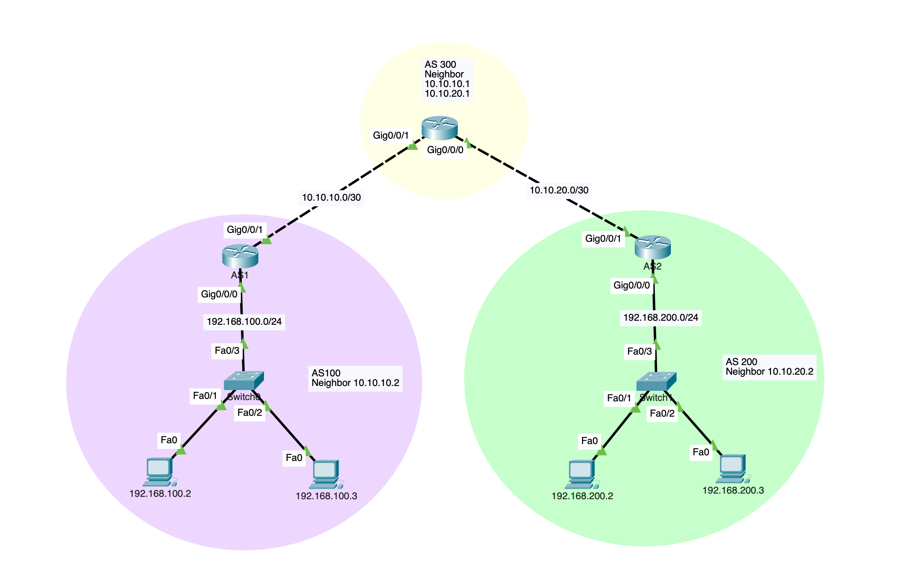

# BGP Inter-Router Connectivity Lab

This repository contains a Cisco Packet Tracer simulation demonstrating a multi-AS (Autonomous System) environment using **External BGP (eBGP)**. The lab establishes routing between two private enterprise networks through a transit Service Provider AS.

## 📍 Network Topology

The setup consists of three Routers representing three distinct Autonomous Systems:
* **AS 100 (Site A):** Local LAN `192.168.100.0/24`
* **AS 200 (Site B):** Local LAN `192.168.200.0/24`
* **AS 300 (ISP/Transit):** The bridge connecting AS 100 and AS 200.

## 🛠️ Router Configuration

### 1. Interface IP Setup
Basic addressing to establish the physical links between the routers.

#### **Router R1 (AS 100)**
```ios
interface g0/0/0
 ip address 192.168.100.1 255.255.255.0
 no shutdown 

interface g0/0/1
 ip address 10.10.10.1 255.255.255.252
 no shutdown
```
#### **Router R2 (AS 200)**
```ios
interface g0/0/0
 ip address 192.168.200.1 255.255.255.0
 no shutdown 

interface g0/0/1
 ip address 10.10.20.1 255.255.255.252
 no shutdown
```

#### **Router R3 (AS 300)**
```ios
interface g0/0/1
 ip address 10.10.10.2 255.255.255.252
 no shutdown 

interface g0/0/0
 ip address 10.10.20.2 255.255.255.252
 no shutdown 
```

### 2. BGP Routing Protocol
The core of the lab involves peering the routers and advertising the local subnets.

| Router | Local AS | Neighbor IP | Remote AS |
| :--- | :--- | :--- | :--- |
| **R1** | 100 | 10.10.10.2 | 300 |
| **R2** | 200 | 10.10.20.2 | 300 |
| **R3** | 300 | 10.10.10.1 & 10.10.20.1 | 100 & 200 |

#### **BGP Configuration Snippets**

**AS 100:**
```ios
router bgp 100
 neighbor 10.10.10.2 remote-as 300
 network 192.168.100.0 mask 255.255.255.0
```

**AS 200:**
```ios
router bgp 200
 neighbor 10.10.20.2 remote-as 300
 network 192.168.200.0 mask 255.255.255.0
```

**AS 300 (Transit):**
```ios
router bgp 300
 neighbor 10.10.10.1 remote-as 100
 neighbor 10.10.20.1 remote-as 200
```

## 🔍 Verification

### BGP Table Entry
After adjacency is established, the BGP table on R1 shows the learned route to AS 200 through AS 300.

```text
Router> show ip bgp
   Network          Next Hop            Metric LocPrf Weight Path
*> 192.168.100.0/24  0.0.0.0                  0          32768 i
*> 192.168.200.0/24  10.10.10.2               0              0 300 200 i
```

### End-to-End Connectivity
Ping results from a PC in AS 100 (`192.168.100.2`) to a PC in AS 200 (`192.168.200.2`):

```text
C:\> ping 192.168.200.2
Pinging 192.168.200.2 with 32 bytes of data:

Request timed out.
Reply from 192.168.200.2: bytes=32 time<1ms TTL=125
Reply from 192.168.200.2: bytes=32 time<1ms TTL=125

Ping statistics: Sent = 4, Received = 3, Lost = 1 (25% loss)
```
*(Note: Initial packet loss is due to ARP and BGP convergence.)*

## 📂 Project Files
* `/lab-files`: Contains the `.pkt` (Packet Tracer) source file.
* `/configs`: Full running configurations in text format.
